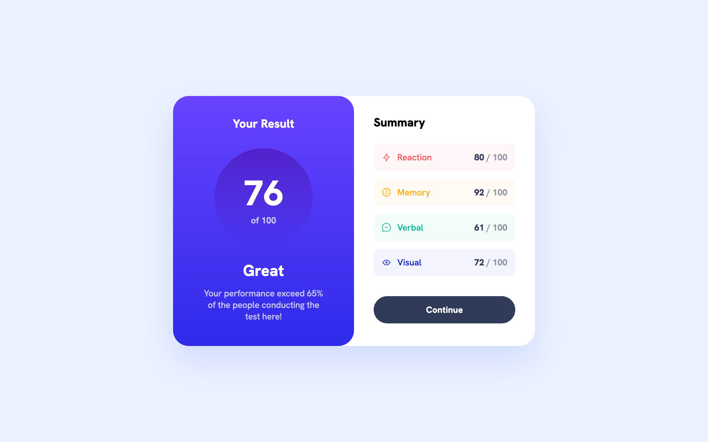
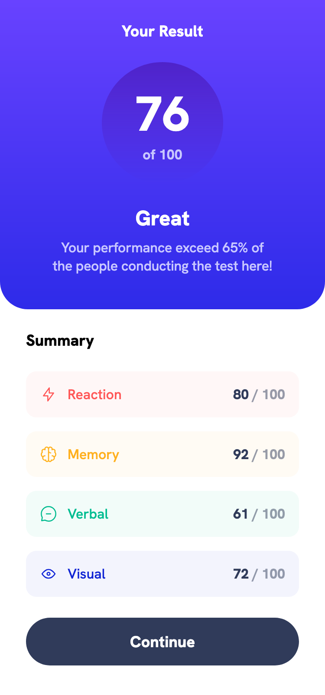

# Frontend Mentor - FAQ accordion solution

This is a solution to the [FAQ accordion challenge on Frontend Mentor](https://www.frontendmentor.io/challenges/faq-accordion-wyfFdeBwBz). Frontend Mentor challenges help you improve your coding skills by building realistic projects. 

## Table of contents

- [Overview](#overview)
  - [The challenge](#the-challenge)
  - [Screenshot](#screenshot)
  - [Links](#links)
- [My process](#my-process)
  - [Built with](#built-with)
  - [What I learned](#what-i-learned)
  - [Continued development](#continued-development)
  - [Useful resources](#useful-resources)
- [Author](#author)
- [Acknowledgments](#acknowledgments)

## Overview

### The challenge

Users should be able to:

- Hide/Show the answer to a question when the question is clicked
- Navigate the questions and hide/show answers using keyboard navigation alone
- View the optimal layout for the interface depending on their device's screen size
- See hover and focus states for all interactive elements on the page

### Screenshot


- Desktop



- Mobile



### Links

- [Solution URL ](https://github.com/fmanimashaun/faq-accordion)
- [Live Site URL](https://fmanimashaun.github.io/faq-accordion/)

## My process

### Built with

- Semantic HTML5 markup
- Sass
- Flexbox
- Mobile-first workflow
- TypeScript
- Vite for development and build process
- GitHub Pages for deployment

### What I learned

It was really cool to create an accordion without writing a single javascript code. To achieve this, i make use of the native accordion functionality provided my the sematic html `details` and `summary` as shown below:

```html
<details>
  <summary>What is Frontend Mentor?</summary>
  <p>Frontend Mentor offers realistic coding challenges to help developers improve their frontend skills.</p>
</details>
```

Then I use css to manage the opening and closing state:

```css
details {
  position: relative;
}

details summary {
  list-style: none;
  appearance: none;
  cursor: pointer;
  display: flex;
  align-items: center;
  gap: 8px;
  padding: 10px;
}

details summary::after {
  content: "";
  width: 16px;
  height: 16px;
  background-image: url('path/to/closed-icon.svg');
  background-size: contain;
  background-repeat: no-repeat;
}

details[open] summary::after {
  background-image: url('path/to/open-icon.svg');
}

```

### Continued development

I plan to explore advanced SASS features to enhance the maintainability and scalability of my stylesheets. I also intend to further integrate TypeScript in future frontend projects to reinforce type safety and streamline debugging.

### Useful resources

- [CSS-Tricks: Flexbox Guide](https://css-tricks.com/snippets/css/a-guide-to-flexbox/) - This guide was instrumental in implementing the flexible layout of the component.
- [MDN Web Docs: CSS Display Property](https://developer.mozilla.org/en-US/docs/Web/CSS/display) - Helped me with controlling element visibility.
- [Frontend Mentor Community](https://www.frontendmentor.io/community) - Engaging with other developers in the community provided insights and useful tips for handling responsive layouts.

## Author

👤 **Engr. Animashaun Fisayo**

- [GitHub](https://github.com/fmanimashaun)
- [Twitter](https://twitter.com/fmanimashaun)
- [LinkedIn](https://www.linkedin.com/in/fmanimashaun/)
- [Website](https://fmanimashaun.com)
- [Blog](https://blog.fmanimashaun.com)


## Acknowledgments

This project was completed as part of the [Frontend Mentor](https://www.frontendmentor.io/) challenge. The platform provided an excellent opportunity to practice and refine my front-end skills through realistic project challenges.
